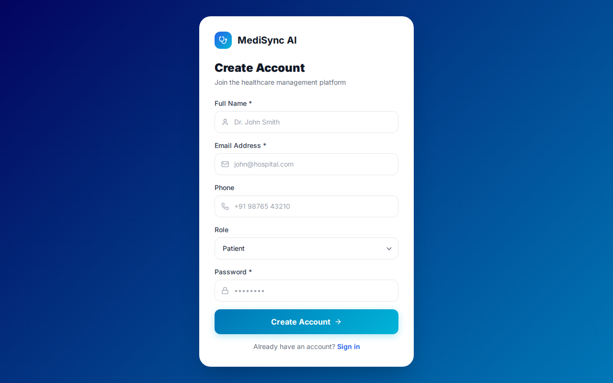
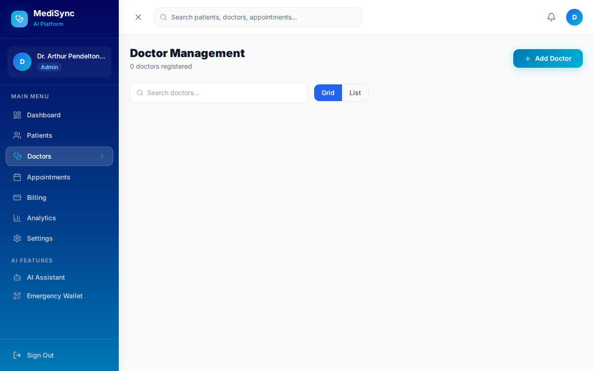
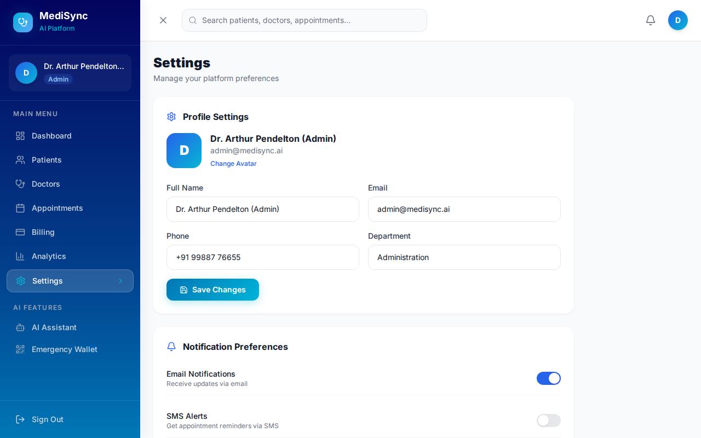
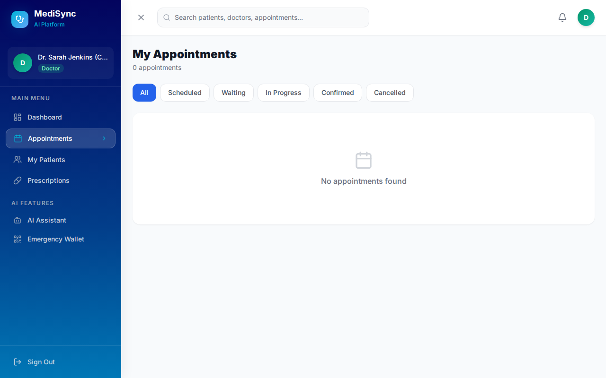
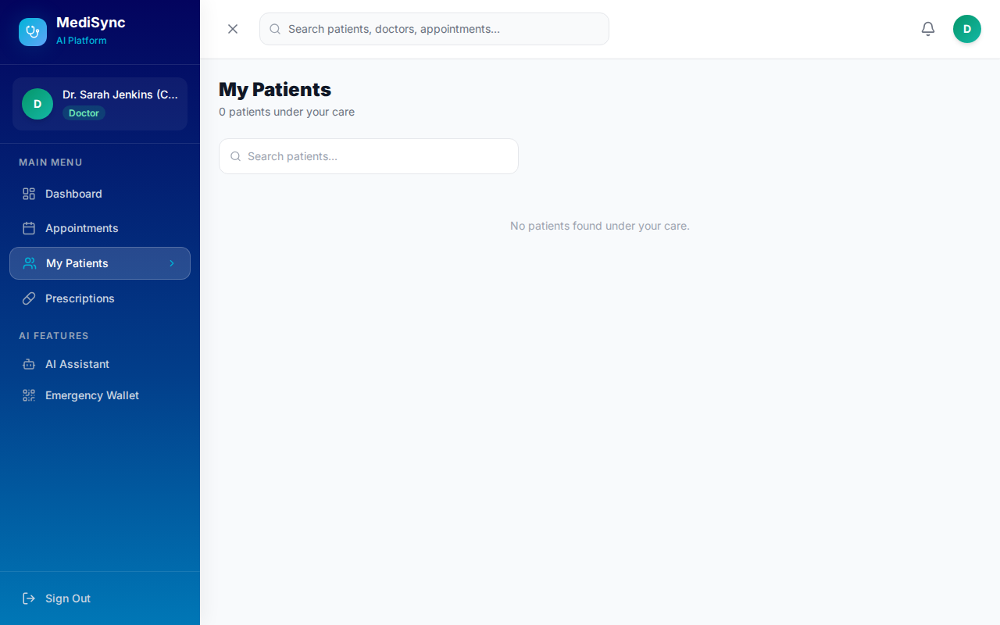

# MediSync AI - Hospital Management System User Manual & Visual Guide

Welcome to the official User Manual and Operational Guide for **MediSync AI**, an enterprise-grade, multi-role Hospital Management System (HMS). This guide provides step-by-step visual workflows, clear GUI navigation instructions, and distinct role screenshots for administrators, doctors, receptionists, pharmacists, and patients.

---

## Table of Contents
1. [System Overview & Architecture](#1-system-overview--architecture)
2. [Getting Started & Account Registration](#2-getting-started--account-registration)
3. [Admin Portal & System Management](#3-admin-portal--system-management)
4. [Doctor Portal & Clinical Consultations](#4-doctor-portal--clinical-consultations)
5. [Receptionist Portal & Intake Desk](#5-receptionist-portal--intake-desk)
6. [Patient Portal & Self-Service](#6-patient-portal--self-service)
7. [Pharmacy Portal & Medication Dispensing](#7-pharmacy-portal--medication-dispensing)
8. [Shared AI & Emergency Tools](#8-shared-ai--emergency-tools)
9. [API Specifications & System Integration](#9-api-specifications--system-integration)
10. [Troubleshooting & FAQ](#10-troubleshooting--faq)

---

## 1. System Overview & Architecture

**MediSync AI** modernizes hospital operations by combining real-time multi-role workflows with AI clinical decision support tools.


### Core Stack
* **Frontend**: React 18, TypeScript, Vite, Tailwind CSS, Lucide React, Framer Motion, Recharts.
* **State Management**: Zustand with persistent client-server state sync.
* **Backend API**: Node.js, Express, TypeScript, JWT Bearer Token Security.
* **Database**: PostgreSQL (Production) / SQLite (Development Fallback).

---

## 2. Getting Started & Account Registration

### Creating a New Account
1. Launch the web interface at `http://localhost:5173`.
2. Click **Create account** or navigate to `/register`.
3. Enter your full name, email address, password, and select your role (`Patient`, `Doctor`, `Receptionist`, `Admin`, or `Pharmacy`).
4. Click **Create Account** to log in automatically.



### Logging In
1. Navigate to `/login`.
2. Click any of the Quick Demo Login role badges or enter your credentials.
3. Click **Sign In** to navigate to your role-specific dashboard.


### Default Demo Credentials
| Role | Email | Password |
| :--- | :--- | :--- |
| **Admin** | `admin@medisync.ai` | `admin123` |
| **Doctor** | `doctor@medisync.ai` | `doctor123` |
| **Receptionist** | `receptionist@medisync.ai` | `recept123` |
| **Patient** | `patient@medisync.ai` | `patient123` |
| **Pharmacy** | `pharmacy@medisync.ai` | `pharmacy123` |

---

## 3. Admin Portal & System Management

The Admin Portal offers executive oversight across patients, doctors, billing, analytics, and system settings.


### Step-by-Step GUI Workflows:
1. **Patient Directory Management (`/dashboard/admin/patients`)**:
   * Search patients by name, filter by department or status, or click **Add Patient** to onboard new patient records.
   

2. **Doctor & Staff Onboarding (`/dashboard/admin/doctors`)**:
   * Click **Doctors** in the sidebar. Add new physicians, set specialties, shift schedules, consultation fees, and upload digital signatures.
   

3. **Billing Oversight & Invoices (`/dashboard/admin/billing`)**:
   * Monitor itemized billing statements, track payment statuses (`Paid`, `Pending`, `Overdue`), generate new invoices, and record payments.
   

4. **Analytics & Financial Intelligence (`/dashboard/admin/analytics`)**:
   * Review revenue growth trends, department patient distributions, bed occupancy, and waiting time metrics.
   

5. **System Settings (`/dashboard/admin/settings`)**:
   * Configure hospital profile info, tax rates, security settings, backup logs, and role permissions.
   

---

## 4. Doctor Portal & Clinical Consultations

Designed for clinicians to manage daily consultations, access patient health records, and issue signed e-prescriptions.


### Step-by-Step GUI Workflows:
1. **Managing Appointments (`/dashboard/doctor/appointments`)**:
   * View scheduled appointments, update patient statuses (`Waiting`, `In Progress`, `Completed`), or add clinical notes.
   

2. **Patient Medical Records (`/dashboard/doctor/patients`)**:
   * Access medical history, vital sign trends, past diagnoses, and allergy alerts before consultations.
   

3. **Issuing Electronic Prescriptions (`/dashboard/doctor/prescriptions`)**:
   * Click **New Prescription**. Select patient, enter drug names, dosages (e.g. 500mg), frequency (e.g. 1-0-1), duration, and clinical notes.
   * Save prescription. The doctor's verified digital signature is automatically attached.
   

---

## 5. Receptionist Portal & Intake Desk

Optimized for front-desk receptionists to handle walk-in registrations, appointment scheduling, and consultation queues.


### Step-by-Step GUI Workflows:
1. **Walk-In Patient Registration (`/dashboard/receptionist/register-patient`)**:
   * Fill in demographics: Name, Age, Phone, Email, Blood Group, Emergency Contact, and Insurance Policy info, then click **Register Patient**.
   

2. **Appointment Booking Desk (`/dashboard/receptionist/book`)**:
   * Select patient, target physician, date/time slot, and set priority level (`Normal`, `High`, `Emergency`).
   

3. **Digital Token Queue Management (`/dashboard/receptionist/queue`)**:
   * Issue sequential consultation tokens and route walk-in patients dynamically to waiting rooms.
   

---

## 6. Patient Portal & Self-Service

Empowers patients to manage appointments, view diagnostic summaries, and pay medical bills online.


### Step-by-Step GUI Workflows:
1. **Medical History & Prescription Vault (`/dashboard/patient/history`)**:
   * View historical consultation summaries, lab results, and download signed e-prescriptions.
   

2. **Viewing & Paying Invoices (`/dashboard/patient/bills`)**:
   * Inspect detailed fee breakdowns and complete digital payments online.
   

---

## 7. Pharmacy Portal & Medication Dispensing

Connects doctors with pharmacists for real-time prescription verification and drug dispensing.


### Step-by-Step GUI Workflows:
1. **Reviewing Incoming Prescriptions**:
   * View real-time incoming electronic prescriptions submitted by doctors.
2. **Dispensing & Verification**:
   * Inspect drug dosage and administration notes. Click **Mark as Dispensed** once medication has been verified.

---

## 8. Shared AI & Emergency Tools

### MediSync AI Clinical Assistant
* Access via sidebar: **AI Assistant**.
* Enter patient symptoms to receive intelligent differential diagnosis suggestions and automated medical summary formatting.


### Emergency Medical Wallet
* Access via sidebar: **Emergency Wallet**.
* Instant access to crucial emergency health metrics: blood group, severe allergies, active conditions, emergency contact numbers, and digital ID badge.


---

## 9. API Specifications & System Integration

Protected REST endpoints utilize standard JWT Bearer Authorization headers:

```
GET  /api/patients             - Fetch registered patients
POST /api/patients             - Register new patient
GET  /api/doctors              - Fetch doctors directory
GET  /api/appointments         - Fetch scheduled consultations
POST /api/appointments         - Schedule new appointment
POST /api/prescriptions        - Issue e-prescription
POST /api/invoices/:id/pay     - Process invoice payment
```

---

## 10. Troubleshooting & FAQ

* **Q: What if the backend server is unreachable?**
  * Ensure Node.js API server is running on port 5000 (`npm run dev` inside `/backend`). The frontend fallback automatically syncs state locally if backend connection drops.
* **Q: How are emergency alerts broadcasted?**
  * When an emergency appointment is created, real-time alert banners pop up on both the Admin and attending Doctor portals.

---
*MediSync AI User Manual & Operational Visual Guide - Version 1.0.0*
