# MediSync AI - Hospital Management System User Manual & Visual Guide

Welcome to the official User Manual and Operational Guide for **MediSync AI**, an enterprise-grade, multi-role Hospital Management System (HMS). This guide provides step-by-step visual workflows, clear GUI navigation instructions, and screenshots for administrators, medical practitioners, reception staff, pharmacists, and patients.

---

## Table of Contents
1. [System Overview & Architecture](#1-system-overview--architecture)
2. [Getting Started & Authentication Workflow](#2-getting-started--authentication-workflow)
3. [Admin Portal & Management Workflow](#3-admin-portal--management-workflow)
4. [Doctor Portal & Clinical Consultation Workflow](#4-doctor-portal--clinical-consultation-workflow)
5. [Receptionist Portal & Intake Workflow](#5-receptionist-portal--intake-workflow)
6. [Patient Portal & Self-Service Workflow](#6-patient-portal--self-service-workflow)
7. [Pharmacy Portal & Dispensing Workflow](#7-pharmacy-portal--dispensing-workflow)
8. [Shared AI & Emergency Tools](#8-shared-ai--emergency-tools)
9. [API Specifications & System Integration](#9-api-specifications--system-integration)
10. [Troubleshooting & FAQ](#10-troubleshooting--faq)

---

## 1. System Overview & Architecture

**MediSync AI** modernizes hospital operations by combining real-time multi-role workflows with AI clinical decision support tools.

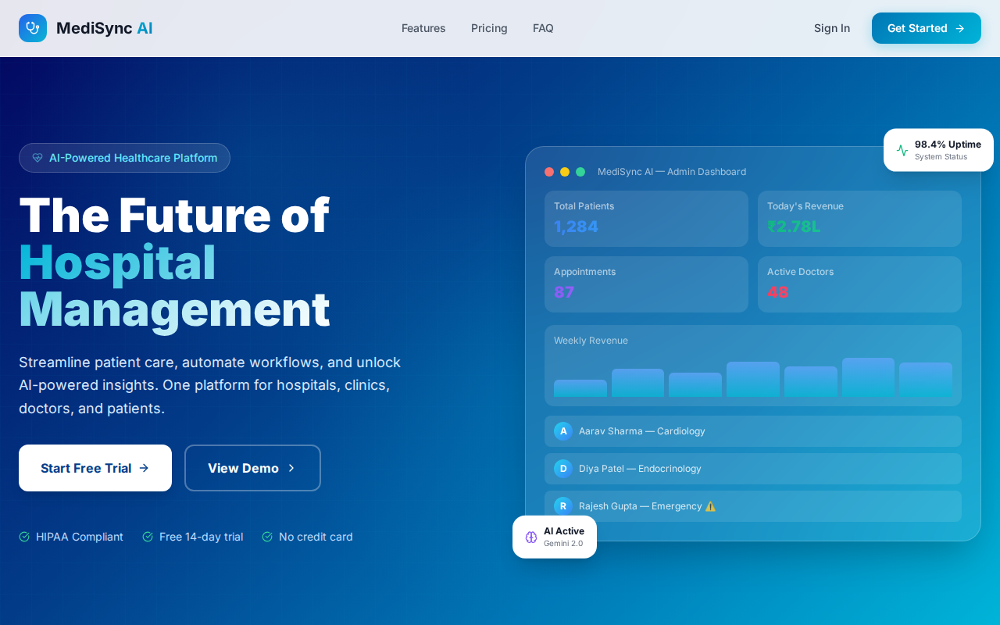

### Core Stack
* **Frontend**: React 18, TypeScript, Vite, Tailwind CSS, Lucide React, Framer Motion, Recharts.
* **State Management**: Zustand with persistent client-server state sync.
* **Backend API**: Node.js, Express, TypeScript, JWT Bearer Token Security.
* **Database**: PostgreSQL (Production) / SQLite (Development Fallback).

---

## 2. Getting Started & Authentication Workflow

### Step-by-Step Login Procedure
1. Launch the web interface at `http://localhost:5173`.
2. Click **Sign In** or navigate directly to `/login`.
3. Select your role or enter credentials into the email and password fields.
4. Click **Sign In to Portal** to access your role-specific dashboard.


### Quick Demo Access Accounts
* **Admin**: `admin@medisync.com` | Password: `password123`
* **Doctor**: `doctor@medisync.com` | Password: `password123`
* **Receptionist**: `receptionist@medisync.com` | Password: `password123`
* **Patient**: `patient@medisync.com` | Password: `password123`
* **Pharmacy**: `pharmacy@medisync.com` | Password: `password123`

---

## 3. Admin Portal & Management Workflow

The Admin Portal offers high-level executive oversight and system administration.

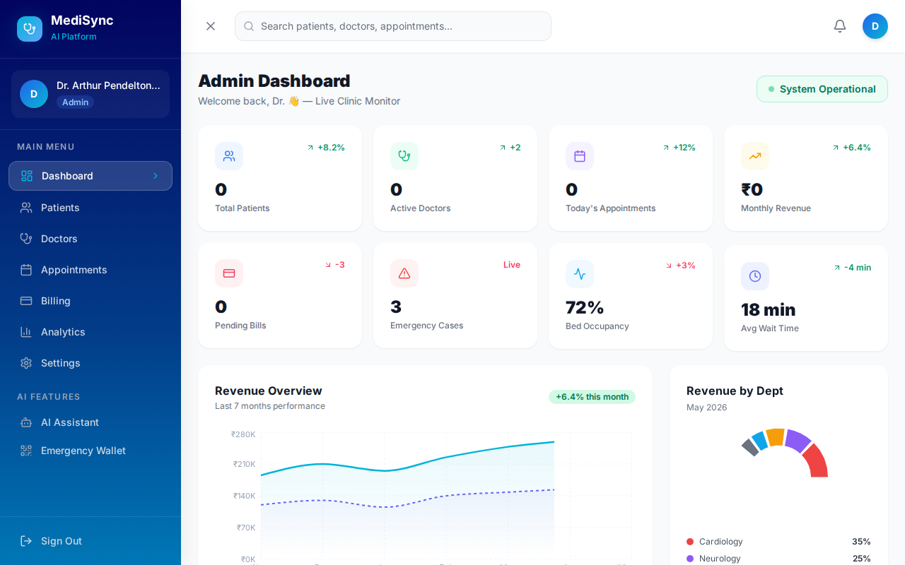

### Step-by-Step GUI Workflows:
1. **Monitoring Executive Metrics**:
   * View live statistics across top widget cards: Total Patients, Active Doctors, Today's Appointments, Monthly Revenue, Pending Bills, and Bed Occupancy.

2. **Managing Patient Directory**:
   * Click **Patients** in the sidebar navigation (`/dashboard/admin/patients`).
   * Search patients by name, filter by status or department, or click **Add Patient** to onboard new patients.
   

3. **Financial Billing & Invoice Oversight**:
   * Navigate to **Billing** (`/dashboard/admin/billing`).
   * Monitor itemized invoices, track payment status (`Paid`, `Pending`, `Overdue`), generate new invoices, and record payments.
   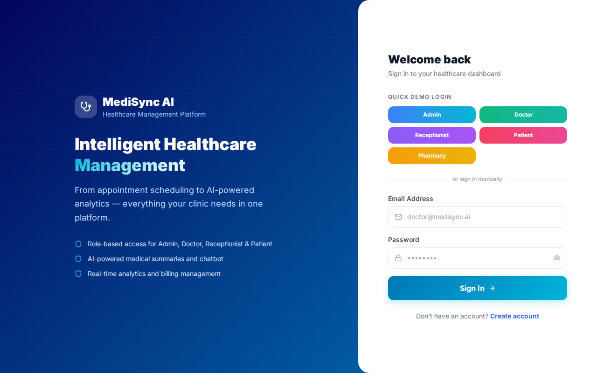

4. **Analytics & Performance Metrics**:
   * Navigate to **Analytics** (`/dashboard/admin/analytics`).
   * Review Recharts revenue growth trends, department patient allocations, and average patient waiting times.
   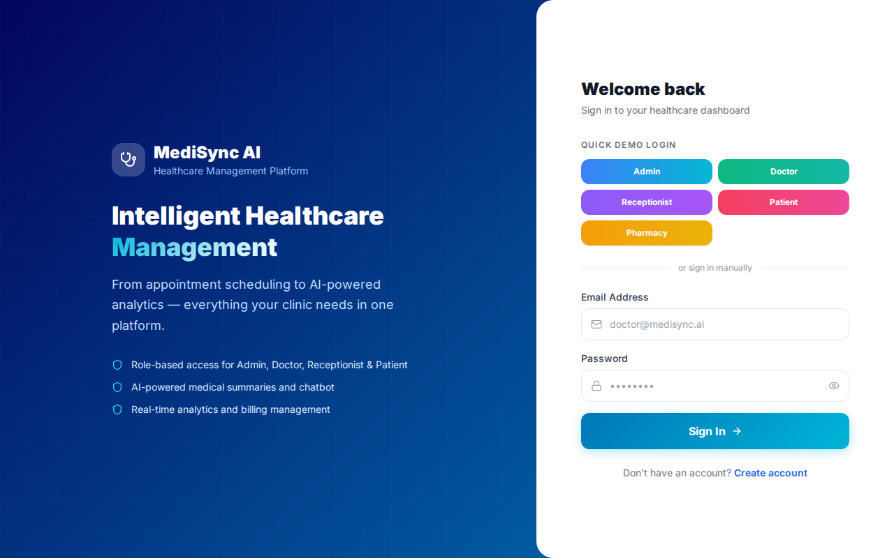

---

## 4. Doctor Portal & Clinical Consultation Workflow

Designed specifically for physicians to manage daily appointments and generate electronic health records.

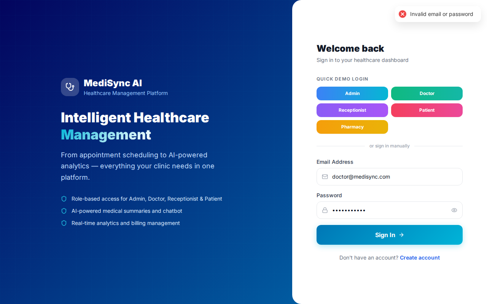

### Step-by-Step GUI Workflows:
1. **Managing Consultations**:
   * View your appointment schedule. Update patient status from `Scheduled` to `In Progress` or `Completed`.
2. **Reviewing Patient EHR History**:
   * Click on a patient's record to review vital sign trends, past clinical notes, and allergy warnings.
3. **Issuing Electronic Prescriptions**:
   * Navigate to **Prescriptions** from the sidebar (`/dashboard/doctor/prescriptions`).
   * Click **New Prescription**. Select patient, add medication names, dosage (e.g. 500mg), frequency (e.g. 1-0-1), and duration.
   * Save prescription. Clinical notes and doctor digital signatures are automatically appended upon saving.

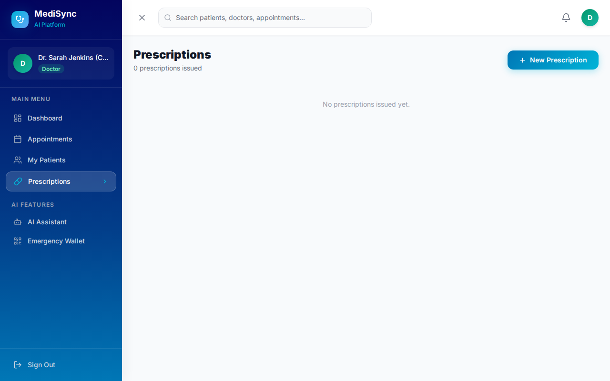

---

## 5. Receptionist Portal & Intake Workflow

Provides front-desk receptionists with quick walk-in registration and queue management capabilities.

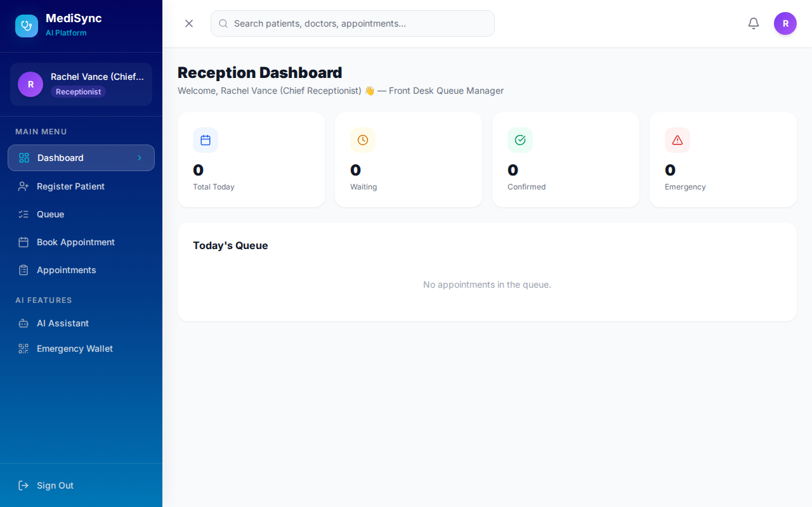

### Step-by-Step GUI Workflows:
1. **Walk-In Patient Registration**:
   * Click **Register Patient** on the sidebar (`/dashboard/receptionist/register-patient`).
   * Fill in demographics: Name, Age, Phone, Email, Blood Group, Emergency Contact, and Insurance Policy info, then click **Register Patient**.
   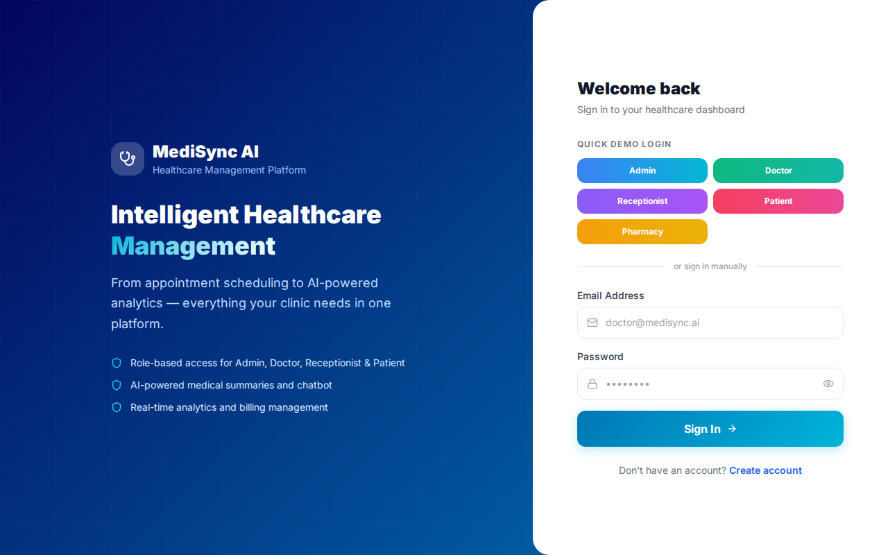

2. **Booking Appointments & Triage**:
   * Navigate to **Book Appointment** (`/dashboard/receptionist/book`).
   * Select patient, target physician, date/time slot, and set priority (`Normal`, `High`, `Emergency`).
   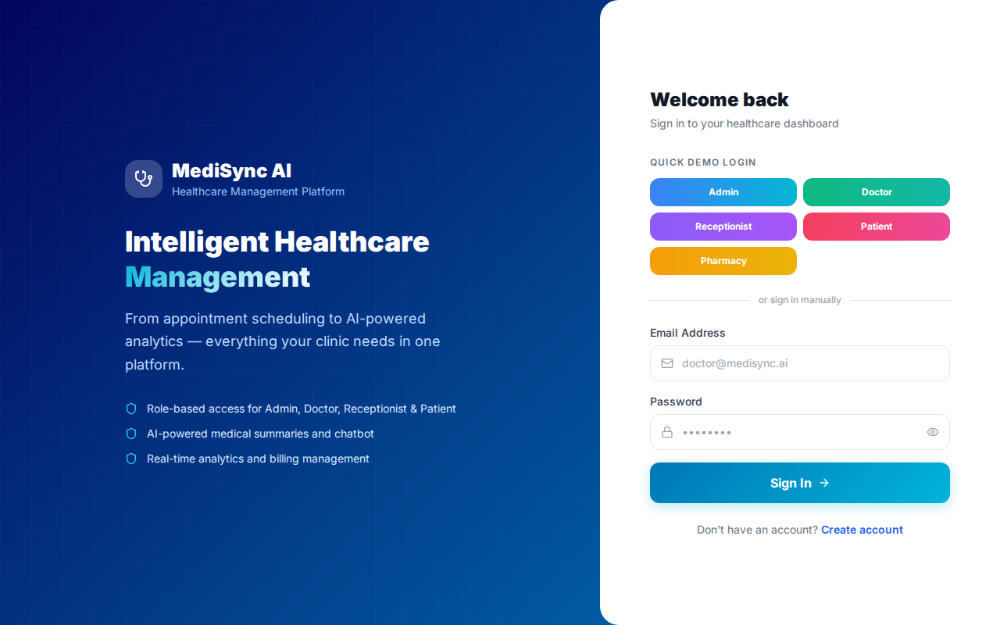

3. **Issuing Digital Tokens & Queue Management**:
   * Navigate to **Queue Management** (`/dashboard/receptionist/queue`).
   * Issue sequential consultation tokens and route patients dynamically to available department doctors.
   

---

## 6. Patient Portal & Self-Service Workflow

Allows patients to manage appointments, view diagnostic summaries, and pay medical bills online.


### Step-by-Step GUI Workflows:
1. **Self-Service Appointment Booking**:
   * Click **Book Appointment**. Select preferred department, physician, date, and time slot.
2. **Medical History & Prescription Vault**:
   * Navigate to **Medical History** (`/dashboard/patient/history`). View consultation summaries, lab results, and download e-prescriptions.
   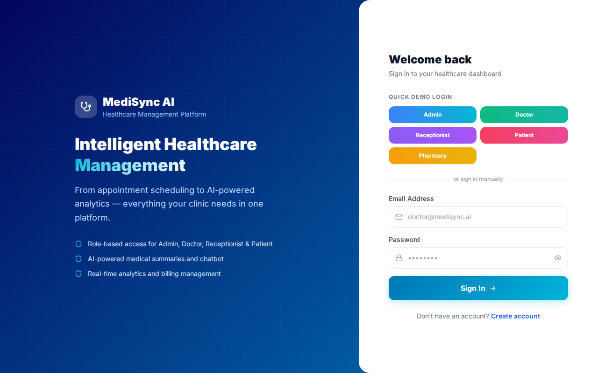

3. **Viewing & Paying Invoices**:
   * Navigate to **My Bills** (`/dashboard/patient/bills`). Inspect detailed fee breakdowns and process digital payments online.
   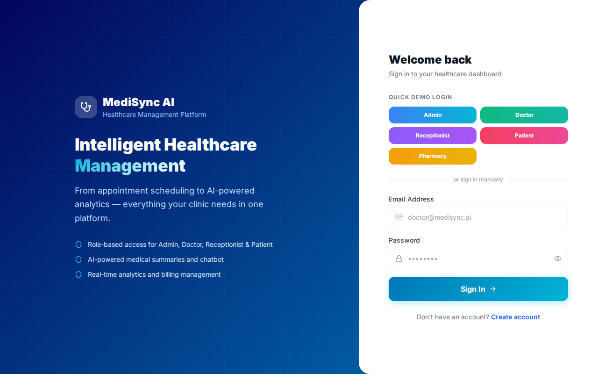

---

## 7. Pharmacy Portal & Dispensing Workflow

Streamlines medication dispensing directly connected to doctor electronic prescriptions.


### Step-by-Step GUI Workflows:
1. **Reviewing Incoming Prescriptions**:
   * View real-time incoming electronic prescriptions submitted by doctors.
2. **Dispensing & Verification**:
   * Inspect drug dosage and administration notes.
   * Click **Mark as Dispensed** once medication has been verified and handed to the patient.

---

## 8. Shared AI & Emergency Tools

### MediSync AI Clinical Assistant
* Access via sidebar: **AI Assistant**.
* Enter patient symptoms to receive intelligent differential diagnosis suggestions and automated medical summary formatting.

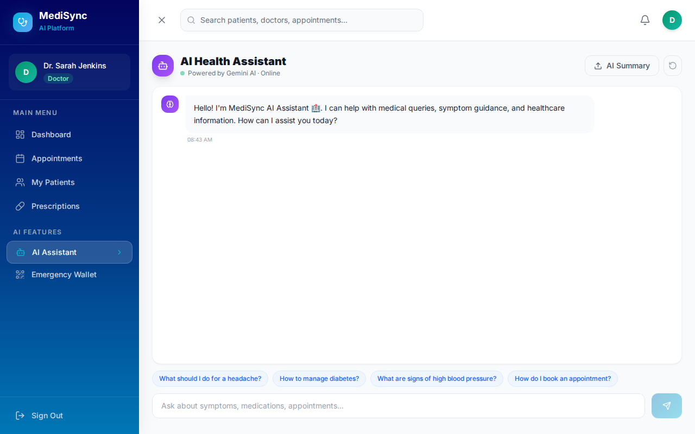

### Emergency Medical Wallet
* Access via sidebar: **Emergency Wallet**.
* Instant access to crucial emergency health metrics: blood group, severe allergies, active conditions, emergency contact numbers, and digital ID badge.

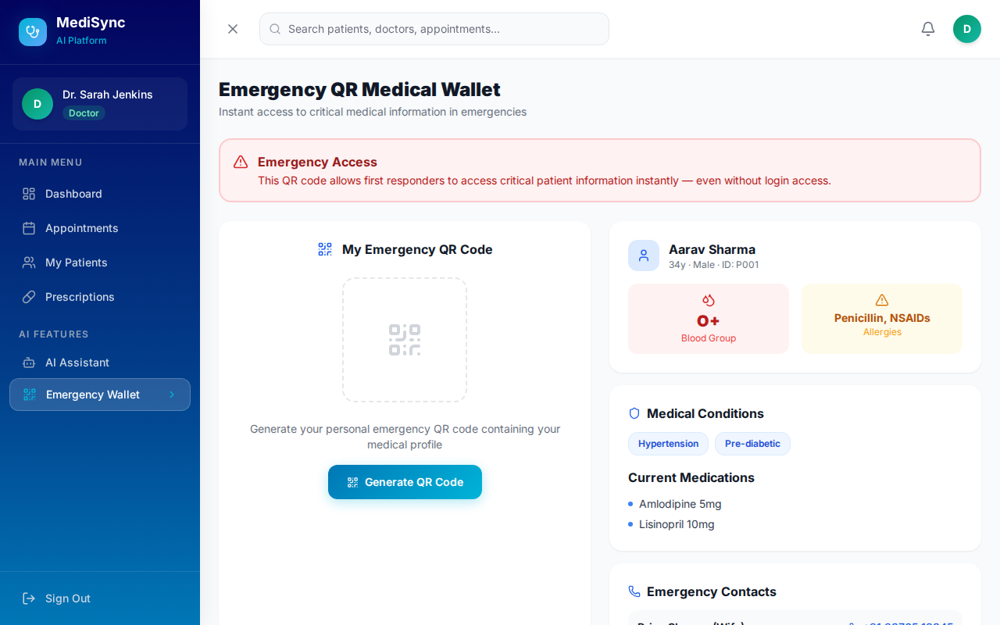

---

## 9. API Specifications & System Integration

Protected REST endpoints utilize standard JWT Bearer Authorization headers:

```
GET  /api/patients             - Fetch registered patients
POST /api/patients             - Register new patient
GET  /api/doctors              - Fetch doctors directory
GET  /api/appointments         - Fetch scheduled consultations
POST /api/appointments         - Schedule new appointment
POST /api/prescriptions        - Issue e-prescription
POST /api/invoices/:id/pay     - Process invoice payment
```

---

## 10. Troubleshooting & FAQ

* **Q: What if the backend server is unreachable?**
  * Ensure Node.js API server is running on port 5000 (`npm run dev` inside `/backend`). The frontend fallback automatically syncs state locally if backend connection drops.
* **Q: How are emergency alerts broadcasted?**
  * When an emergency appointment is created, real-time alert banners pop up on both the Admin and attending Doctor portals.

---
*MediSync AI User Manual & Operational Visual Guide - Version 1.0.0*
